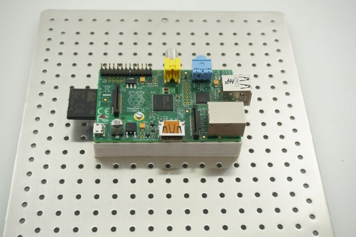

# Rasberry Pi 

Raspberry Pi MLAB assimilation breakout frame

Documents and design files describing a method of how to use classic [Raspberry Pi](https://en.wikipedia.org/wiki/Raspberry_Pi) in the MLAB prototyping system.
<!--- ELead ---> 

 

​
​
<!--- Description --->
<!--- EDescription --->
<!--- Content --->
<!--- EContent --->
            
